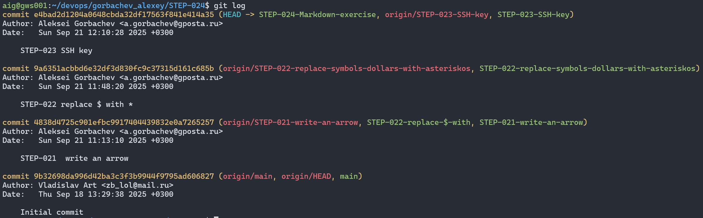

## Навигация
- [Операции git](#операции-git)
- [Описание git gui](#описание-git-gui)
- [Скриншот истории коммитов](#скриншот-истории-коммитов)

## Операции git
- **git pull** - обновляет вашу локальную ветку из удаленного репозитория. Это комбинация двух команд **git fetch** (забирает изменения из удаленного репозитория) и **git merge** (объединяет изменения с вашей веткой) 
- **git push** - отправляет ваши коммиты из локальной ветки в удаленный репозиторий (например, на GitHub/GitLab).
- **git squash** - объединение нескольких коммитов в один для создания чистой истории. 
- **git reset** - изменяет указатель HEAD и может изменять индекс и рабочую директорию. Это способ "отменить" изменения.

## Описание git gui  
Для работы с git я использовал терминальную версию. Она универсальная будет работать с любым git.

## Скриншот истории коммитов

